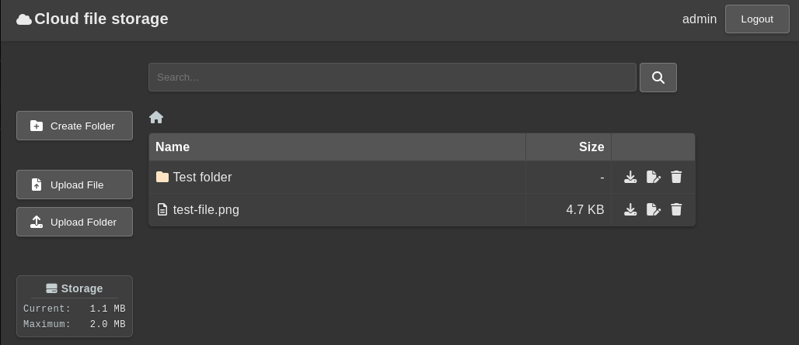
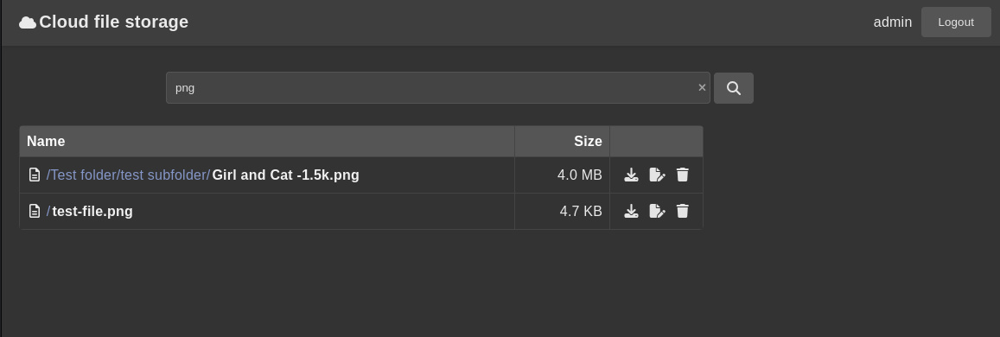

Проект “Облачное хранилище файлов”
===============================================================================================

Многопользовательское облачное хранилище файлов. Пользователи могут регистрироваться, загружать, скачивать, удалять и переименовывать свои файлы, а также организовывать их в папки. Источником вдохновения для проекта является Google Drive.

(Пет-проект, написанный для освоения и закрепления навыков в Java, Spring Boot и других технологиях)

Оглавление
----------

1. [Использованные инструменты / технологии](#использованные-инструменты--технологии)
2. [Интерфейс приложения](#интерфейс-приложения)
3. [Базы данных](#базы-данных)
4. [Требования приложения](#требования-приложения)
5. [Инструкция по запуску приложения](#инструкция-по-запуску-приложения)
6. [Техническое задание](#техническое-задание)

## Использованные инструменты / технологии:

### Backend

 &nbsp;
 &nbsp;
 &nbsp;
 &nbsp;
 &nbsp;
 &nbsp;
 &nbsp;
 &nbsp;
 &nbsp;


### Testing

 &nbsp;


### Frontend

 &nbsp;
 &nbsp;
 &nbsp;


### Инфраструктура

 &nbsp;
 &nbsp;


## Интерфейс приложения

### Главная страница

URL - '/'
- Отображает список файлов и папок пользователя в виде файловой структуры (аналогично Windows Explorer).
- Поддерживает загрузку файлов и папок (POST-запросы на `/upload-file`, `/upload-folder`), скачивание (GET-запросы на `/download-file`, `/download-folder`), удаление (POST-запросы на `/delete-folder`, `/delete-file`), переименование (POST-запросы на `/rename-folder`, `/rename-file`) и создание папки (POST-запросы на `/create-folder`).
- Навигация по папкам через GET-параметр `path` (например, `/?path=/folder/subfolder`).

### Страница поиска

URL - '/search'
- Поиск файлов по названию с помощью GET-запроса `?query=<search-term>`.

### Страница входа
URL - '/auth/login'
- Форма входа с POST-запросом на `/auth/login` для аутентификации.

### Страница регистрации
URL - '/auth/register'
- Форма регистрации с POST-запросом на `/auth/register` для создания пользователя.

### Страница ошибок

URL - '/error'
- Отображает ошибки (например, 400, 403, 404, 500) с кастомными сообщениями и тёмной темой.

## Базы данных

- Таблица `users`: Хранит данные пользователей (id, username, password).
- Используется MySQL для хранения пользовательских данных и Redis для сессий.

## Требования приложения

+ Java 21+
+ Apache Maven
+ MySQL 9.1+
+ MinIO (для хранения файлов)
+ Redis (для управления сессиями)
+ Docker (для запуска зависимостей)

## Инструкция по запуску приложения

### Клонирование репозитория

1. **Клонирование репозитория с помощью Git**:
    - Откройте терминал или командную строку.
    - Выполните команду:
      ```sh
      git clone https://github.com/VladShi/cloudfilestorage.git
      ```
    - Перейдите в директорию проекта:
      ```sh
      cd cloudfilestorage
      ```

### Настройка проекта

1. **Настройка конфигурационного файла**:
    - В корне проекта находится файл `application.properties.origin`.
    - Переименуйте его в `application.properties`:
      ```sh
      cp application.properties.origin application.properties
      ```
    - Откройте файл `application.properties` и убедитесь, что он настроен для чтения переменных из `.env` (если используются placeholders вроде `${MYSQL_HOST}`). Обычно это не требуется, так как Spring Boot автоматически подтягивает переменные окружения.

2. **Настройка переменных окружения**:
    - В корне проекта находится файл `.env.example`, содержащий пример необходимых данных.
    - Создайте файл `.env` на основе `.env.example`:
      ```sh
      cp .env.example .env
      ```
    - Откройте `.env` и заполните его необходимыми данными.
    - Эти переменные будут использованы `docker-compose.yml` и `application.properties`.

3. **Запуск зависимостей через Docker**:
    - Убедитесь, что Docker и Docker Compose установлены.
    - В корне проекта находится файл `docker-compose.yml`, который запускает MySQL, MinIO и Redis.
    - Выполните команду для запуска сервисов в фоновом режиме:
      ```sh
      docker-compose up -d
      ```
    - Проверьте, что сервисы работают:
      ```sh
      docker-compose ps
      ```

### Сборка JAR-файла

1. **Сборка с помощью Maven**:
    - Перейдите в корневую папку проекта, где находится файл `pom.xml`.
    - Выполните команду:
      ```sh
      mvn clean package
      ```
    - После успешной сборки JAR-файл будет создан в директории `/target` (например, `/target/cloudfilestorage-1.0.jar`).

### Запуск приложения

1. **Запуск JAR-файла**:
    - Выполните команду:
      ```sh
      java -jar target/cloudfilestorage-1.0.jar
      ```
    - Приложение будет доступно по адресу `http://localhost:8080`.

2. **Запуск в IntelliJ IDEA**:
    - Откройте проект в IntelliJ IDEA.
    - Настройте конфигурацию запуска: выберите `Spring Boot` и укажите главный класс `CloudFileStorageApplication`.
    - Нажмите `Run`.

### CI/CD
- Проект использует GitHub Actions для автоматизации сборки и тестирования. Workflow-файлы находятся в `.github/workflows/`.

Техническое задание
==
(данный проект делался на основе этого ТЗ)

*   [Что нужно знать](#что-нужно-знать)
*   [Мотивация проекта](#мотивация-проекта)
*   [Функционал приложения](#функционал-приложения)
*   [Интерфейс приложения](#интерфейс-приложения)
    *   [Главная страница](#главная-страница)
    *   [Страница поиска файлов](#страница-поиска-файлов)
    *   [Остальное](#остальное)
*   [Работа с сессиями, авторизацией, регистрацией](#работа-с-сессиями-авторизацией-регистрацией)
*   [SQL база данных](#sql-база-данных)
    *   [Миграции](#миграции)
*   [Хранилище файлов S3](#хранилище-файлов-s3)
    *   [Структура S3 хранилища](#структура-s3-хранилища)
    *   [Работа с S3 из Java](#работа-с-s3-из-java)
*   [Upload файлов](#upload-файлов)
    *   [Загрузка папок](#загрузка-папок)
*   [Тесты](#тесты)
    *   [Интеграционные тесты сервиса по работе с 
    пользователями](#интеграционные-тесты-сервиса-по-работе-с-пользователями)
    *   [Интеграционные тесты сервиса по работе с файлами и 
    папками](#интеграционные-тесты-сервиса-по-работе-с-файлами-и-папками)
*   [Docker](#docker)
*   [Деплой](#деплой)
*   [План работы над приложением](#план-работы-над-приложением)

Что нужно знать
---------------

*   Java - коллекции, ООП
*   Maven/Gradle
*   Backend
    *   Spring Boot, Spring Security, Spring Sessions
    *   Thymeleaf
    *   Upload файлов, заголовки HTTP запросов, cookies, cессии
*   Базы данных
    *   SQL
    *   Spring Data JPA
    *   Миграции
    *   Представление о NoSQL хранилищах
*   Frontend- HTML/CSS, Bootstrap
*   Тесты - интеграционное тестирование, JUnit, Testcontainers
*   Docker - контейнеры, образы, volumes, Docker Compose
*   Деплой - облачный хостинг, командная строка Linux, Tomcat

Мотивация проекта
-----------------

*   Использование возможностей Spring Boot
*   Практика с Docker и Docker Compose
*   Первый проект, где студент самостоятельно разрабатывает структуру БД
*   Знакомство с NoSQL хранилищами - S3 для файлов, Redis для сессий

Функционал приложения
---------------------

Работа с пользователями:

*   Регистрация
*   Авторизация
*   Logout

Работа с файлами и папками:

*   Загрузка (upload) файлов и папок
*   Создание новой пустой папки (аналогично созданию новой папки в проводнике)
*   Удаление
*   Переименование
*   Скачивание файлов и папок

Интерфейс приложения
--------------------

### Главная страница

Адрес - `/?path=$path_to_subdirectory`. Параметр `$path` задаёт путь просматриваемой папки. Если параметр отсутствует, 
подразумевается корневая папка. Пример - `/path=Projects%2FJava%2FCloudFileStorage` (параметр закодирован через URL 
Encode).

*   Заголовок
    *   Для неавторизованных пользователей - кнопки регистрации и авторизации
    *   Для авторизованных пользователей - логин текущего пользователя и кнопка Logout
*   Контент (только для авторизованных пользователей)
    *   Форма поиска файлов и папок по названию
    *   Навигационная цепочка (breadcrumbs), содержащая путь из папок до текущей папки. Каждый элемент является ссылкой 
    на свою папку. Пример - цепочка из папок, ведущая к - `Projects/Java/CloudFileStorage` содержала бы 3 папки - 
    корневую, `Projects` и `Projects/Java`
    *   Список файлов в текущей директории. Для каждого файла отображаем имя и кнопку, вызывающее меню действий 
    (удаление, переименование)
    *   Формы (или drop areas) для загрузки файлов и папок

### Страница поиска файлов

Адрес - `/search/?query=$search_query`.

Неавторизованные пользователя не имеют доступа к данной странице, приложение должно редиректить их на форму авторизации.

*   Заголовок
    *   Логин текущего пользователя и кнопка Logout
*   Контент
    *   Форма поиска файлов и папок по названию
    *   Список найденных файлов. Для каждого найденного файла отображаем имя и кнопку для перехода в папку, содержащую 
    данный файл

### Остальное

*   Страницы с формами регистрации и авторизации

Работа с сессиями, авторизацией, регистрацией
---------------------------------------------

В предыдущем проекте мы управляли сессиями пользователей вручную, в этом проекте воспользуемся возможности экосистемы 
Spring Boot.

За авторизацию, управление доступом к страницам отвечает Spring Security.

За работу с сессиями отвечает Spring Sessions. По умолчанию Spring Boot хранит сессии внутри приложения, и они теряются 
после каждого перезапуска приложения. Мы воспользуемся Redis для хранения сессий. Пример - 
[https://www.baeldung.com/spring-session](https://www.baeldung.com/spring-session). Redis - NoSQL хранилище, имеющее 
встроенный TTL (time to live) атрибут для записей, что делает его удобным для хранения сессий - истекшие сессии 
автоматически удаляются.

SQL база данных
---------------

В этом проекте студент самостоятельно разрабатывает структуру базы данных для хранения пользователей (файлы и сессии 
располагаются в других хранилищах). Предлагаю использовать Postgres/MySQL/MariaDB.

Ориентироваться стоит на интеграцию с Spring Security. Эта библиотека экосистемы Spring подразумевает определённые 
атрибуты, которыми должен обладать пользователь, и список которых и станет основой колонок для таблицы `Users`.

Пример интеграции между Spring Security и Spring Data JPA - [https://www.baeldung.com/registration-with-spring-mvc-
and-spring-security](https://www.baeldung.com/registration-with-spring-mvc-and-spring-security).

Важно помнить о создании необходимых индексов в таблице `Users`. Например, логин пользователя должен быть уникальным.

### Миграции

Схема БД в этом проекте очень простая, но тем не менее рекомендую попрактиковаться с миграциями. Если в прошлом проекте 
вы использовали Flyway, в этом можно взять Liquibase, или наоборот.

Хранилище файлов S3
-------------------

Для хранения файлов будем пользоваться S3 - simple storage service. Проект, разработанный Amazon Cloud Services, 
представляет из себя облачный сервис и протокол для файлового хранилища. Чтобы не зависеть от платных сервисов Amazon 
в этом проекте, воспользуемся альтернативным S3-совместимым хранилищем, которое можно запустить локально - 
[https://min.io/](https://min.io/)

*   Докер образ для локального запуска MinIO - 
[https://hub.docker.com/r/minio/minio/](https://hub.docker.com/r/minio/minio/)
*   Для работы с протоколом S3 воспользуемся 
[Minio Java SDK](https://min.io/docs/minio/linux/developers/java/minio-java.html)

### Структура S3 хранилища

В SQL мы оперируем таблицами, в S3 таблиц не существует, вместо этого S3 оперирует бакетами (bucket - корзина) с 
файлами. Чтобы понять что такое бакет, можно провести аналогию с диском или флешкой.

Внутри бакета можно создавать файлы и папки.

Для хранения файлов всех пользователей в проекте создадим для них бакет под названием `user-files`. В корне бакета для 
каждого пользователя будет создана папка с именем в формате `user-${id}-files`, где `id` является идентификатором 
пользователя из SQL базы.

Каждая из таких папок является корнем для хранения папок данного пользователя. Пример - файл `docs/test.txt` 
пользователя с id `1` должен быть сохранён в путь `user-1-files/docs/test.txt`.

### Работа с S3 из Java

Как было упомянуто выше, для работы с S3 воспользуемся Minio Java SDK. Необходимо будет научиться пользоваться этой 
библиотекой, чтобы:

*   Создавать файлы
*   Переименовывать файлы
*   “Переименовывать” папки. Насколько знаю в S3 нет такой операции, переименование папки по сути представляет собой 
создание папки под новым именем и перенос туда файлов
*   Удалять файлы

Upload файлов
-------------

Для загрузки файлов необходимо воспользоваться HTML file input - [https://developer.mozilla.org/en-US/docs/Web/HTML/
Element/input/file](https://developer.mozilla.org/en-US/docs/Web/HTML/Element/input/file). Распространённый подход 
оформить это в виде зоны, на которую можно перетягивать файлы из проводника, пример - 
[https://codepen.io/dcode-software/pen/xxwpLQo](https://codepen.io/dcode-software/pen/xxwpLQo).

На уровне HTTP, передача файлов осуществляется с помощью `multipart/form-data`.

Со стороны Spring Boot необходимо будет реализовать контроллер(ы) для обработки загруженных файлов. Важно иметь в виду, 
что по-умолчанию лимит на загрузку файлов в Spring Boot равен 10 мегабайтам, но его можно увеличить.

### Загрузка папок

File input может быть использован для загрузки либо отдельных файлов, либо папок (если у input установлен атрибут
[webkitdirectory](https://developer.mozilla.org/en-US/docs/Web/HTML/Element/input/file#webkitdirectory)), но не 
одновременно.

Получается, что необходимо иметь 2 input’а - для файлов, и для папок. Возможно, существуют Javascript библиотеки, 
которые решают этот вопрос и реализуют единый input для обоих случаев.

Тесты
-----

### Интеграционные тесты сервиса по работе с пользователями

Как и в прошлом проекте, покроем тестами связку слоя данных с классами-сервисами, отвечающими за пользователей.

Вместо с H2 предлагаю воспользоваться Testcontainers для запуска тестов в контексте полноценной (а не in-memory) базы 
данных. Это позволяет приблизить окружение тестов к рабочему окружению, и тестировать нюансы, специфичные для 
конкретных движков БД.

Примеры тест кейсов:

*   Вызов метода “создать пользователя” в сервисе, отвечающем за работу с пользователями, приводит к появлению новой 
записи в таблице `users`
*   Создание пользователя с неуникальным username приводит к ожидаемому типу исключения

### Интеграционные тесты сервиса по работе с файлами и папками

Опциональное задание повышенной сложности - покрыть тестами взаимодействие с сервисом хранения данных, работающим Minio.

Примеры тест кейсов:

*   Загрузка файла приводит к его появлению в bucket’е Minio в корневой папке текущего пользователя
*   Переименование, удаление файлов и папок приводит к ожидаемому результату
*   Проверка прав доступа - пользователь не должен иметь доступа к чужим файлам
*   Поиск - пользователь может находить свои файлы, но не чужие

Что потребуется:

*   Интеграция JUnit и Spring Security
*   Реализация [GenericContainer](https://www.testcontainers.org/features/creating_container/) для интеграции Minio и 
Testcontainers

Docker
------

В данном проекте впервые воспользуемся Docker для удобного запуска необходимых приложений - SQL базы, файлового 
хранилища MinIO и хранилища сессий Redis.

Необходимо:

*   Найти образы для каждого нужного приложения из списка выше
*   Написать Docker Compose файл для запуска стека с приложениями (по контейнеру для каждого)
*   Знать Docker Compose команды для работы со стеком

Как будет выглядеть работа с Docker:

*   Для работы над проектом запускаем стек из контейнеров
*   Уничтожаем или останавливаем контейнеры (с сохранением данных на volumes), когда работа не ведётся
*   По необходимости уничтожаем данные на volumes, если хотим очистить то или иное хранилище, запустить

Деплой
------

Будем вручную деплоить jar артефакт. Для его запуска не требуется Tomcat, потому что в собранное Spring Boot приложение 
уже встроен веб-сервер. Все остальные приложения этого проекта (SQL, Redis, MinIO) запускаем через Docker Compose.

Шаги:

*   Локально собрать jar артефакт приложения
*   В хостинг-провайдере по выбору арендовать облачный сервер на Linux
*   Установить JRE, Docker
*   Скопировать на удалённый сервер Docker Compose файл для запуска MySQL, Redis, MinIO
*   Скопировать на удалённый сервер локально собранный jar, запустить

Ожидаемый результат - приложение доступно по адресу `http://$server_ip:8080/`.

План работы над приложением
---------------------------

*   Docker Compose - добавить MySQL
*   Spring Boot - с помощью Spring Security, Thymeleaf и Spring Data JPA реализовать регистрацию и авторизацию 
пользователей
*   Интеграционные тесты для сервиса регистрации
*   Docker Compose - добавить MinIO
*   Spring Boot - интегрировать Minio Java SDK и научиться совершать операции с файлами в бакете, написать сервис, 
инкапсулирующий необходимые для приложения операции
*   Реализовать загрузку файлов и папок через форму (формы) на главной странице
*   Реализовать отображение файлов и навигацию по структуре директорий, действия с файлами (удаление, переименование)
*   Поиск файлов - сервис, контроллер и Thymeleaf шаблон
*   (Опционально) интеграционные тесты для сервиса, отвечающего за работу с файлами и папками
*   Docker Compose - добавить Redis
*   Spring Sessions - сконфигурировать хранение сессий внутри Redis
*   Деплой
